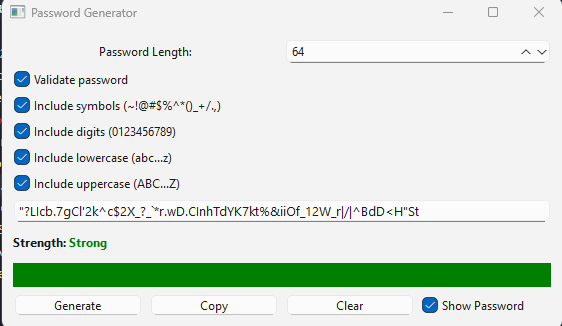

# 🔐 PyQt6 Password Generator

A user-friendly **desktop application** built with **Python** and **PyQt6** for generating secure, customizable passwords with validation and strength indicators.

---

## 📸 Screenshot



---

## ✨ Features

- 🔢 Select **password length** (6–64 characters)
- ✅ Toggle inclusion of:
  - Lowercase letters (a–z)
  - Uppercase letters (A–Z)
  - Digits (0–9)
  - Symbols (e.g., ~!@#$%^&*)
- 🔒 **Enable validation** to ensure the password includes at least one of each selected character type
- 👁️ Show/hide password
- 📋 Copy password to clipboard
- ❌ Clear password field
- 🟢 Password **strength indicator** with visual progress bar (Weak / Medium / Strong)
- 🧠 Default selections: lowercase, uppercase, and digits

---

## 🧰 Requirements

- Python 3.10 or higher
- PyQt6

---

## 🚀 How to Run the Application

### Step 1: Clone the Repository
```bash

git clone https://github.com/melissa0987/password-generator.git
cd password-generator

```

### Step 2: Create a Virtual Environment (Recommended)
```bash 

py -m venv .venv

#On Windows:
.venv\Scripts\activate


#On macOS/Linux:
source .venv/bin/activate 
```

### Step 3: Install Dependencies
```bash
pip install PyQt6
```

### Step 4: Run the Application
```bash
python main.py
```

---

##  🧪 Example Use Case
1. Set the desired password length (e.g., 16).

2. Select which character types to include.

3. Enable "Validate password" if you want the password to meet all selected criteria.

4 Click "Generate".

5. If validation passes, the password will appear.

6. Use "Copy" to copy it to clipboard or "Clear" to reset the field.

---

##  📝 License
This project is licensed under the MIT License.
You are free to use, modify, and distribute this software with proper attribution.

📝 Note: This project was developed for academic purposes as part of coursework at Vanier College.