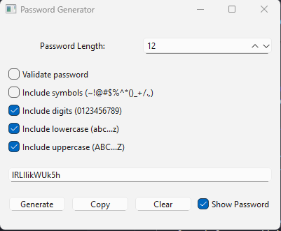

# 🔐 PyQt6 Password Generator

A simple and user-friendly **desktop application** built using **Python** and **PyQt6** that generates secure, customizable passwords with validation options.

---

## 👩‍💻 Developer Information

- **Name:** Melissa Louise Bangloy 
- **Student ID:** 1468444
- **Course:** 420-942-VM – Application Development 1: Desktop
- **Institution:** Vanier College

---

## 📸 Screenshots


---

## ✨ Features

- Choose **password length** (6–64 characters)
- Toggle inclusion of:
  - ✅ Lowercase letters (a–z)
  - ✅ Uppercase letters (A–Z)
  - ✅ Digits (0–9)
  - ✅ Symbols (e.g., ~!@#$%^&*)
- Enable **password validation** to ensure at least one of each selected type is included
- Show/hide password
- Copy password to clipboard
- Clear password field
- Default selections: lowercase, uppercase, and digits

---

## 🧰 Requirements

- Python 3.10+
- PyQt6

## 🚀 How to Run the Program

### Step 1: Clone the Repository

```bash

git clone https://github.com/melissa0987/password-generator.git
cd password-generator

```

### Step 2: Create a Virtual Environment (Recommended)
```bash 

py -m venv .venv

#On Windows:
.venv\Scripts\activate


#On macOS/Linux:
source .venv/bin/activate 
```

### Step 3: Install Dependencies
```bash
pip install PyQt6
```

### Step 4: Run the Application
```bash
python main.py
```

---

##  🧪 Example Use Case
- Set length to 16.

- Enable all character types and validation.

- Click Generate.

- If validation passes, the password will be displayed.

- Use Copy to copy the password or Clear to remove it.

---

##  📝 License
This project is intended for academic use as part of coursework at Vanier College.